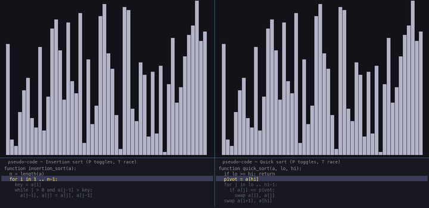

# Sorting Visualizer



*Race mode: insertion sort vs quick sort on the same 50-element array.*

A Python + pygame visualization of six classic sorting algorithms, with
controls for stepping, speed, array size, algorithm selection, a side-by-side
race mode, and a synchronized pseudo-code panel.

## Quick start

```bash
cd ~/Projects/sorting
python3 -m venv .venv
source .venv/bin/activate
pip install -r requirements.txt
python sort.py
```

> **Python 3.14 note:** `pygame` 2.6.1 has a circular-import bug with Python 3.14's stricter module loading that breaks `pygame.font`. We use `pygame-ce` (community fork) which has the fix. Code is `import pygame` exactly the same.

Run race mode directly from CLI:

```bash
python sort.py --race --race-left quick --race-right merge --size 80 --speed 100
```

## Algorithms

| Key | Algorithm | Time (best / avg / worst) | Space |
|---|---|---|---|
| 1 | Bubble sort | n / n² / n² | O(1) |
| 2 | Selection sort | n² / n² / n² | O(1) |
| 3 | Insertion sort | n / n² / n² | O(1) |
| 4 | Merge sort | n log n / n log n / n log n | O(n) |
| 5 | Quick sort | n log n / n log n / n² | O(log n) avg |
| 6 | Heap sort | n log n / n log n / n log n | O(1) |

## Controls

### Solo mode

| Input | Action |
|---|---|
| `Space` | Play / pause |
| `.` | Step one op forward (only when paused) |
| `R` | Reset current run with same array |
| `N` | New random array |
| `1`–`6` | Switch algorithm |
| `+` / `-` | Increase / decrease array size |
| `[` / `]` | Decrease / increase play speed |
| `P` | Toggle pseudo-code panel |
| `T` | Enter race mode (with current algo on left, quick sort on right) |
| `Q` / `Escape` | Quit |

### Race mode (when toggled on with `T`)

| Input | Action |
|---|---|
| `Space` | Play / pause both |
| `.` | Step both one op forward (only when paused) |
| `R` | Reset both with same new array |
| `N` | Same as R |
| `1`–`6` | Switch **left** algorithm |
| `z`–`m` | Switch **right** algorithm (z=1, x=2, c=3, v=4, b=5, m=6) |
| `,` / `.` | Decrease / increase **left** speed |
| `[` / `]` | Decrease / increase **right** speed |
| `P` | Toggle pseudo-code panel |
| `T` | Exit race mode |
| `Q` / `Escape` | Quit |

**Tip:** Race mode shines when one side is at a low speed and the other is cranked up. Watch insertion sort at 5 ops/s against quick sort at 1000 ops/s — same input, and the apparent speed advantage of quick sort is dramatic.

## Architecture

Three layers in one file:

1. **Algorithms** — pure generators yielding operations. No pygame knowledge.
2. **Runner** — paces a generator against wall-clock, collects stats.
3. **Renderer** — pygame event loop, draws bars, stats, pseudo-code panel.

Algorithms communicate with the renderer via a small op vocabulary:

```python
("compare", i, j)            # highlight both bars yellow
("swap", i, j)               # swap arr[i], arr[j]; flash red
("write", i, value)          # arr[i] = value (for merge sort's aux buffer)
("mark_sorted", i)           # bar i is in its final sorted position
("line", line_index)         # highlight pseudo-code line
```

A new algorithm is added by writing one generator function and registering it in `ALGORITHMS` and `PSEUDO_CODE`. None of the renderer needs to change.

### Race mode

Race mode runs **two runners on independently-shuffled copies of the same
starting array**. Each runner ticks at its own speed. The first to finish
gets a ▶ WINNER overlay. A live Δ-compared count shows how far behind the
slower one is.

Asymmetric speeds are intentional and useful: e.g. set both algorithms to
the same speed to do a true apples-to-apples comparison, or crank the
"winner candidate" up to 1000 ops/s to see the gap close visually.

## Color conventions

| Color | Meaning |
|---|---|
| Gray-blue | Normal / unsorted |
| Yellow | Currently being compared |
| Red | Currently being swapped / written |
| Green | In final sorted position |

## Stats

Each run tracks:

- Comparisons
- Writes / swaps (wins on in-place; merge sort counts aux buffer writes)
- Time elapsed (ms)
- Operation count
- Speed (ops/sec)

In race mode, each side shows its own stats; ▶ WINNER appears on the first finisher; the header shows `Δ compares: N`.

## Out of scope for v1

- Sound (pitch per compare/swap)
- Custom data input
- Save as GIF/MP4
- More than 6 algorithms
- Mobile / responsive layout
- Configurable color themes

## Known limitations

- Quick sort uses Lomuto partition with last-element pivot, which is **O(n²)** on already-sorted or reverse-sorted input. The visualization will look "stuck" for a few seconds on such inputs. Choosing a different input via `N` (new array) or `--race --race-left quick --race-right bubble` (where bubble sort has the pathological case instead) shows quick sort's typical case fairly.

## Verification

Run the built-in correctness tests:

```bash
python -c "
import sort, random
rng = random.Random(42)
scenarios = [
    ('reversed',   list(reversed(range(50)))),
    ('already-sorted', list(range(50))),
    ('random',     [rng.randint(1, 1000) for _ in range(50)]),
    ('duplicates', [rng.choice([1, 5, 7, 9, 12]) for _ in range(50)]),
    ('small', [3, 1, 4, 1, 5, 9, 2, 6, 5, 3, 5]),
    ('single', [42]),
    ('empty', []),
]
fails = []
for name, fn in sort.ALGORITHMS.items():
    for label, arr in scenarios:
        arr2 = list(arr)
        ops = list(fn(arr2))
        if arr2 != sorted(arr):
            fails.append((name, label))
print('FAIL' if fails else 'ALL 42 SCENARIOS PASS')
"
```
